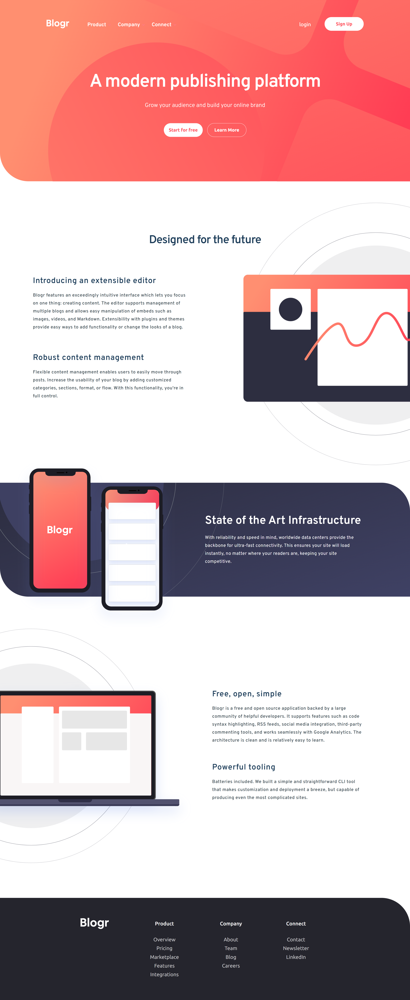
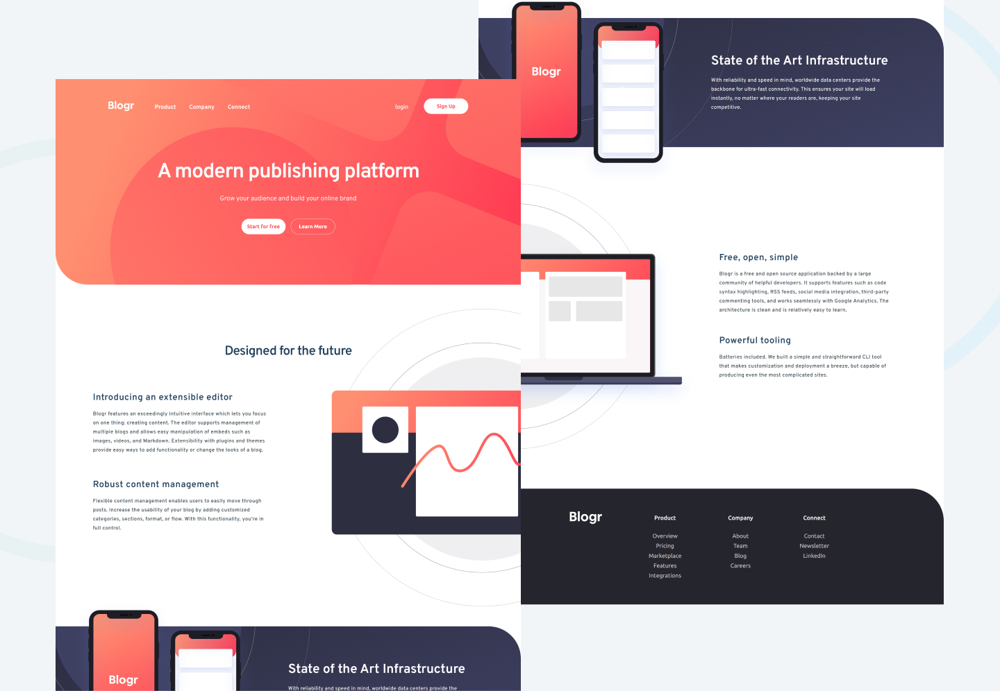

# Frontend Mentor - Blogr landing page solution

This is a solution to the [Blogr landing page challenge on Frontend Mentor](https://www.frontendmentor.io/challenges/blogr-landing-page-EX2RLAApP). Frontend Mentor challenges help you improve your coding skills by building realistic projects. 

## Table of contents

- [Overview](#overview)
  - [The challenge](#the-challenge)
  - [Screenshot](#screenshot)
  - [Links](#links)
- [My process](#my-process)
  - [Built with](#built-with)
  - [What I learned](#what-i-learned)
  - [Continued development](#continued-development)
  - [Useful resources](#useful-resources)
- [Author](#author)

## Overview

### The challenge

Users should be able to:

- View the optimal layout for the site depending on their device's screen size
- See hover states for all interactive elements on the page

### Screenshot

### Links

- Solution URL: (https://github.com/arbaiv/blogr-landing-page-challenge)
- Live Site URL: (https://wonderful-heliotrope-02aeac.netlify.app/)

## My process

### Built with

- Semantic HTML5 markup
- CSS custom properties
- Flexbox
- CSS Grid
- Mobile-first workflow
- JavaScript

### What I learned

- Learned about nextElementSibling and prevElementSibling JS properties.
- How to use CSS Variables.
- The use of Transform-box and transform-origin in CSS to add animation to the SVG from it's center.
- How to make an infinite animation loop with that starts with a delay every time.
- How to add a background-image and a linear-gradient at the same time in CSS.
- How to position background-image outside of container.

### Continued development

I have to be consistent in my work and improve project time management. 

### Useful resources

- [Resource 1](https://css-tricks.com/css-keyframe-animation-delay-iterations/) - This helped me to add a delay every time the animation loops.
- [Resource 2](https://www.w3schools.com/jsref/prop_element_nextelementsibling.asp) - I learned about the nextElementSibling and prevElementSibling property uses.

## Author

- LinkedIn - [Abdur Rahaman](https://www.linkedin.com/in/abdur-rahaman-arb4/)
- Github - [@arbaiv](https://github.com/arbaiv)
- Twitter - [@arbaiv](https://twitter.com/arbaiv)
- Frontend Mentor - [@arbaiv](https://www.frontendmentor.io/profile/arbaiv)
